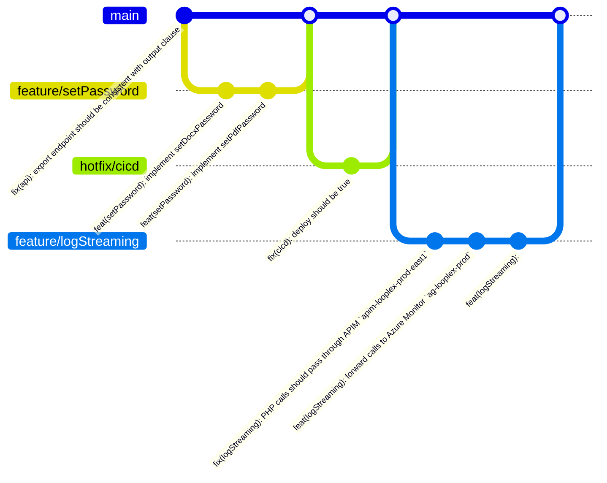

<a name="readme-top"></a>


[](https://github.com/developit/microbundle#readme)
[](https://japa.dev/)
[](https://standardjs.com)
[](http://commitizen.github.io/cz-cli/)
[](https://semantic-release.gitbook.io/semantic-release/)


<details>
  <summary>Table of Contents</summary>
  <ol>
    <li>
      <a href="#about-the-project">About</a>
    </li>
    <li>
      <a href="#getting-started">Getting Started</a>
      <ul>
        <li><a href="#prerequisites">Prerequisites</a></li>
        <li><a href="#installation">Installation</a></li>
      </ul>
    </li>
    <li><a href="#usage">Usage</a></li>
    <li><a href="#roadmap">Roadmap</a></li>
    <li><a href="#contributing">Contributing</a></li>
    <li><a href="#license">License</a></li>
  </ol>
</details>


## About

Start explaining **WHY** this project exists, **WHAT** it's trying to do, **WHO** is it built for, and keep going with **WHERE** and **WHEN** it's designed to be used.

<p align="right">(<a href="#readme-top">back to top</a>)</p>


## Getting Started

### Prerequisites

* npm
  ```sh
  npm install npm@latest -g
  ```

### Installation

1. Clone the repo
   ```sh
   git clone https://github.com/looplex/{{repo_name}}.git
   ```
1. Install NPM packages
   ```sh
   npm ci
   ```
1. Check current tests coverage
   ```sh
   npm test
   ```

<p align="right">(<a href="#readme-top">back to top</a>)</p>


## Usage

Use this space to show useful examples of how a project can be used. Additional screenshots, code examples and demos work well in this space. You may also link to more resources.

<p align="right">(<a href="#readme-top">back to top</a>)</p>


## Roadmap

- [ ] Feature 1
- [ ] Feature 2
- [ ] Feature 3
    - [ ] Nested Feature

See the [open issues](https://github.com/github_username/{{repo_name}}/issues) for a full list of proposed features (and known issues).

<p align="right">(<a href="#readme-top">back to top</a>)</p>


## Contributing

Contributions are what make the open source community such an amazing place to learn, inspire, and create. Any contributions you make are **greatly appreciated**.

If you have a suggestion that would make this better, please fork the repo and create a pull request. You can also simply open an issue with the tag "enhancement".
Don't forget to give the project a star! Thanks again!

We follow the [GitHub flow](https://docs.github.com/en/get-started/using-github/github-flow) git workflow, which is basically:

1. Fork the Project
1. Create your Feature Branch (`git checkout -b feature/amazing-feature`)
1. Code your Amazing Feature
1. Commit your Changes (`npm run cz`)
1. Push to the Branch (`git push origin feature/amazing-feature`)
1. Open a Pull Request

_exempli gratia_:



<p align="right">(<a href="#readme-top">back to top</a>)</p>


## License

Distributed under the Looplex Limited Public License. See `LICENSE.md` for more information.

<p align="right">(<a href="#readme-top">back to top</a>)</p>
